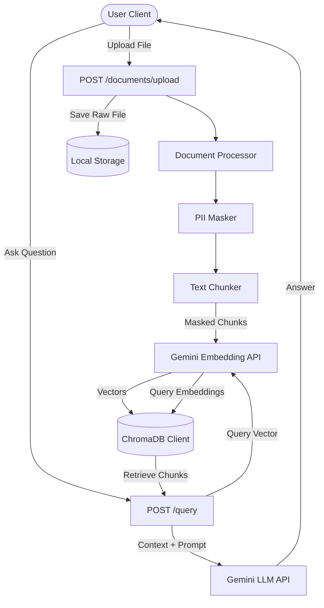

# Secure Document Query System (Secure Doc RAG)

A production-grade, retrieval-augmented generation (RAG) system built with **FastAPI**, **ChromaDB**, and the **Google Gemini API**. This application is designed for enterprise environments where data security, multi-tenant isolation, and privacy compliance are top priorities.

## Key Features

- **Strict Customer-Data Isolation**: Multi-tenant data segregation is enforced at the storage layer. Every customer has their own dedicated ChromaDB collection (`customer_{customer_id}`) and isolated disk directory for uploaded files.
- **Automatic PII Masking**: Automatically scans all uploaded documents for sensitive information (e.g., JWT tokens, API keys, passwords, client/customer IDs, credit cards, SSNs, emails, phone numbers, IP addresses) and masks them *before* embedding and database storage.
- **Support for Multiple Formats**: Built-in parsers for PDF, Word (`.docx`), and Plain Text (`.txt`) documents.
- **Advanced Gemini Integration**:
  - Semantic embeddings using `models/text-embedding-004`.
  - Context-aware answers via the `gemini-1.5-flash` model.
- **Fully Documented REST API**: Built on FastAPI with clean JSON inputs/outputs and automatic OpenAPI documentation.

---

## Architecture Diagram



---

## Directory Structure

```text
secure-doc-rag/
├── app/
│   ├── __init__.py
│   ├── config.py             # Environment configuration (Pydantic Settings)
│   ├── api/
│   │   ├── __init__.py
│   │   └── routes.py         # FastAPI HTTP endpoints (Upload, Query, List, Delete)
│   ├── core/
│   │   ├── __init__.py
│   │   ├── document_processor.py # Parsing (PDF, Word, Text) & Chunking
│   │   ├── embeddings.py     # Gemini embedding API integration
│   │   ├── pii_masker.py     # Regex-based PII identification and masking
│   │   └── rag_pipeline.py   # RAG querying orchestrator
│   ├── db/
│   │   ├── __init__.py
│   │   └── chroma_client.py  # ChromaDB persistent client & collection manager
│   └── models/
│       ├── __init__.py
│       └── schemas.py        # Pydantic request and response models
├── data/                     # Local data directory (Git ignored)
│   ├── chroma_db/            # ChromaDB persistent store
│   └── uploads/              # Uploaded raw files structured by customer ID
├── .env                      # API keys & local configuration settings (Git ignored)
├── .gitignore
├── main.py                   # FastAPI main entrypoint & lifespan handling
└── requirements.txt          # Python project dependencies
```

---

## Setup & Installation

### 1. Prerequisites
- Python 3.9+
- A Google Gemini API Key. You can get one from [Google AI Studio](https://aistudio.google.com/).

### 2. Clone the Repository & Install Dependencies
Navigate to the project root and install the required Python packages:
```bash
pip install -r requirements.txt
```

### 3. Environment Configuration
Create a `.env` file in the root directory (refer to `.env.example` if applicable):
```env
GEMINI_API_KEY=your_gemini_api_key_here
GEMINI_LLM_MODEL=gemini-1.5-flash
GEMINI_EMBEDDING_MODEL=models/text-embedding-004
CHROMA_PERSIST_DIR=./data/chroma_db
UPLOAD_DIR=./data/uploads
MAX_FILE_SIZE_MB=10
CHUNK_SIZE=1000
CHUNK_OVERLAP=200
TOP_K_RESULTS=5
```

---

## Running the Application

Start the FastAPI application locally using Uvicorn:
```bash
uvicorn main:app --reload
```
By default, the server runs on `http://127.0.0.1:8000`.

- **API Interactive Docs (Swagger UI)**: `http://127.0.0.1:8000/docs`
- **Alternative ReDoc Docs**: `http://127.0.0.1:8000/redoc`

---

## API Endpoints

### 1. Upload & Index Document
Parses, cleans/masks PII, chunks, and inserts document vectors into the customer-specific vector database.
* **Endpoint**: `POST /api/v1/documents/upload`
* **Content-Type**: `multipart/form-data`
* **Form Data**:
  - `customer_id` (string): Unique identifier for the customer (e.g., `cust_123`).
  - `file` (file): Uploaded file (`.pdf`, `.docx`, or `.txt`).

### 2. Query Documents
Queries customer documents using semantic search and answers questions using the context.
* **Endpoint**: `POST /api/v1/query`
* **Content-Type**: `application/json`
* **Request Body**:
  ```json
  {
    "customer_id": "cust_123",
    "query": "What is the policy on password length?"
  }
  ```
* **Response Body**:
  ```json
  {
    "customer_id": "cust_123",
    "query": "What is the policy on password length?",
    "answer": "Passwords must be at least 12 characters long and contain numbers.",
    "sources": ["security_policy.pdf"],
    "context_chunks_used": 3
  }
  ```

### 3. List Customer Documents
Lists all raw filenames uploaded and successfully indexed/processed for a specific customer.
* **Endpoint**: `GET /api/v1/documents/{customer_id}`
* **Response Body**:
  ```json
  {
    "customer_id": "cust_123",
    "documents": ["security_policy.pdf", "onboarding_guide.docx"],
    "total_chunks": 42
  }
  ```

### 4. Delete Customer Documents
Deletes document chunks from ChromaDB and removes corresponding files from the disk. Can delete a specific document or purge all customer data.
* **Endpoint**: `DELETE /api/v1/documents`
* **Content-Type**: `application/json`
* **Request Body** (Delete Specific Document):
  ```json
  {
    "customer_id": "cust_123",
    "filename": "security_policy.pdf"
  }
  ```
* **Request Body** (Delete All Customer Data):
  ```json
  {
    "customer_id": "cust_123"
  }
  ```

---

## Security & Compliance Strategy

### 1. Per-Customer Isolation
- **Disk Isolation**: Uploaded files are saved under `data/uploads/{customer_id}/{filename}`. Customers cannot access directories of other IDs.
- **Database Isolation**: In ChromaDB, every customer gets their own named collection (`customer_{customer_id}`), ensuring vector similarity matches only target that specific customer's document space.

### 2. Automatic PII Masking
Documents often contain credentials or user emails. The `pii_masker.py` uses high-precision regular expressions to automatically mask:
- Credit Card info
- SSNs
- API/Secret Keys & JWT Tokens
- Passwords
- Emails, Phone numbers, & IP addresses

These are masked *prior* to vectorization, meaning no sensitive plain text values are saved to the vector database or sent to external APIs for embedding generation, ensuring compliance with data privacy regulations (e.g. GDPR, HIPAA).
